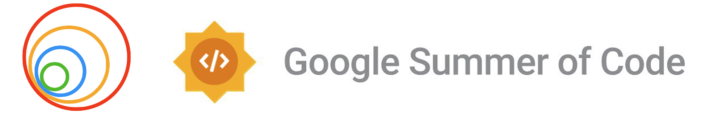

## End-to-End Autonomous Vehicle Driving Based on Text-Based Instructions

    

[GitHub](https://github.com/TheRoboticsClub/gsoc2024-ZebinHuang) | [Website](https://theroboticsclub.github.io/gsoc2024-ZebinHuang/) | [Video](https://youtu.be/lnmpi-fqVZE) | [Meeting Logs](https://docs.google.com/document/d/1b2ZEU5Gt8gP2ae_YzNSJSd7RukUrsG_aDJFLnbvoQiM/edit?tab=t.0#heading=h.isdep2i97rn2) | [Model Card](https://huggingface.co/zebin-huang/gsoc2024-ZebinHuang) | [Data Card](https://theroboticsclub.github.io/gsoc2024-ZebinHuang/)

## About the project

🚀 Project Goal: Integrating Large Language Models with end-to-end autonomous driving models. This project is supported by [2024 Google Summer of Code](https://summerofcode.withgoogle.com/) and [JdeRobot](https://jderobot.github.io/activities/gsoc/2024#ideas-list).

## Project Structure

Each folder contains related documentation.
- **carla_llms**
  This folder includes an end-to-end demo generated based on large language models and validated in CARLA.

- **data_parsing**
  This directory contains the original development version, used for standalone testing of all scripts. It serves as the core environment for debugging and optimizing the functionality of the scripts.

- **streamlit**
  This is the web-based streamlit app, packaged for online deployment using the Streamlit framework.

- **carla**
  This directory integrates the model with the CARLA simulation for testing and validation.

- **docs**
  Documentation files related to the project, including blogs and technical references.

## Acknowledgments

* [gsoc2023-Meiqi_Zhao](https://github.com/TheRoboticsClub/gsoc2023-Meiqi_Zhao)
